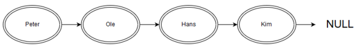

# Find the n’th customer from the right

You are given a directed graph of `Customer`s, where one `Customer` has exactly one reference to the next `Customer` or `null` - if it is the last `Customer`.
An example of such a graph can be seen in the diagram below.



Given such a graph find the customer `int numberFromRight` nodes from right in the graph by implementing the following interface:

C#
```csharp
public interface IFinder {
    string FromRight(Customer customer, int numberFromRight);
}
```

Java
```java
public interface IFInder {
    String fromRight(Customers customers, int numberFromRight);
}
```

For instance in the graph above the result for `FromRight(peter, 3)` is Ole.

# Solution

Implement your solution in the `Finder` file.
If you see `// YOUR SOLUTION GOES HERE` you've found the right place :-)

You're not allowed to change any other files.

## What you'll be evaluated on

Please note that extra points are given for a solution that allocates as little extra memory and iterates the graph as few times as possible.

This should be not interpreted in terms of complexity theory but actual iterations and memory usage.
For instance, is it possible to iterate the graph only once while only using a constant number of extra pointers?

Remember to leave comments in your code, to let us know about your thought process.
