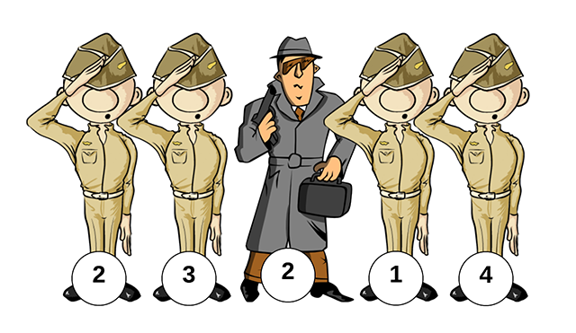

# Find the secret agent

Someone has infiltrated your regiment. It is your job, as the commanding officer, to write a function that finds this secret agent.

You know the following:

- There are 'n' soldiers in your regiment
- All soldiers have a unique id between 1 and 'n'
- In order to hide himself, the agent has forged an id between 1 and 'n'. This means one of the ids appear twice!

To identify the secret agent, you have collected all of the ids from your regiment in a list.
You should implement the following interface, and write a function that searches the list of ids and returns the id that appears twice.

C#
```csharp
public interface IFindSecretAgent
{
    int StartSearch(IEnumerable<int> ids);
}
```

Java
```java
public interface IFindSecretAgent {
    int startSearch(Iterable<Integer> ids);
}
```

## Example
In the following example, the function should return 2



# Solution

Implement your solution in the `FindSecretAgent` file.
If you see `// YOUR SOLUTION GOES HERE` you've found the right place :-)

## What you'll be evaluated on

When implementing this interface, comments should be included in the code, to reflect your thoughts on the solution's space and time complexity.
An efficient solution gets a better score.
